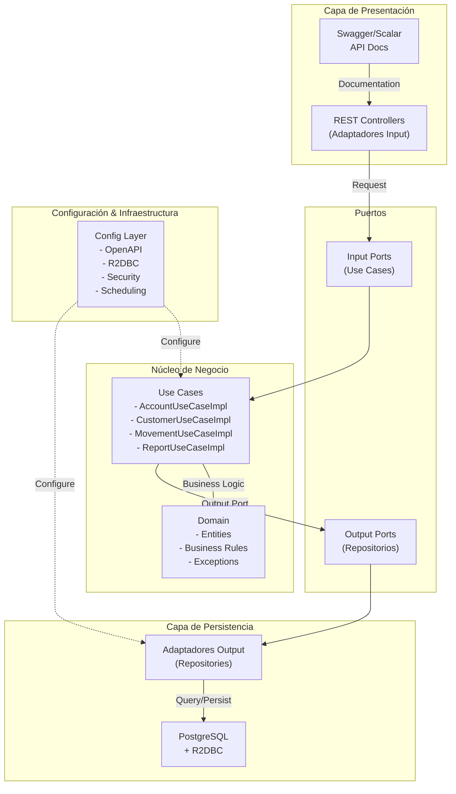
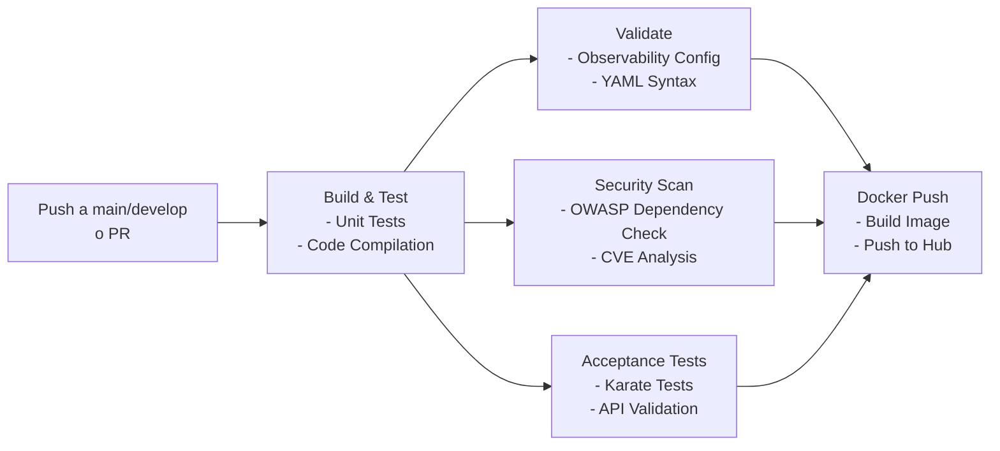

# 🏦 Bank Service - Backend Application

[](https://openjdk.java.net/)
[](https://spring.io/projects/spring-boot)
[](LICENSE)
[]()

Una aplicación backend moderna y escalable construida con **Spring Boot 4.0**, **WebFlux** y **Arquitectura Hexagonal**. 
Esta solución implementa principios de código limpio, reactividad no bloqueante y observabilidad empresarial completa.

---

## 📋 Tabla de Contenidos

- [Características](#características)
- [Arquitectura](#arquitectura)
- [Tecnologías](#tecnologías)
- [Estructura del Proyecto](#estructura-del-proyecto)
- [Requisitos Previos](#requisitos-previos)
- [Instalación](#instalación)
- [Ejecución](#ejecución)
- [Testing](#testing)
- [Docker & Docker Compose](#docker--docker-compose)
- [Observabilidad & SRE](#observabilidad--sre)
- [CI/CD](#cicd)
- [Despliegue](#despliegue)
- [Contribuciones](#contribuciones)

---

## ✨ Características

- ✅ **Arquitectura Hexagonal** - Separación clara de responsabilidades entre capas
- ✅ **Código Limpio** - Principios SOLID, nombres descriptivos y estructura modular
- ✅ **Reactividad con WebFlux** - Procesamiento no bloqueante con Reactor
- ✅ **Base de Datos Reactiva** - PostgreSQL con R2DBC
- ✅ **Migrations automáticas** - Flyway para versionado de BD
- ✅ **Seguridad** - Spring Security integrado
- ✅ **API Documentation** - Swagger UI + Scalar/Redoc
- ✅ **Testing Completo** - Unit tests, Integration tests, Acceptance tests (Karate)
- ✅ **Observabilidad** - OpenTelemetry, Prometheus, Loki, Grafana, Tempo
- ✅ **Validación de Seguridad** - OWASP Dependency Check en CI/CD
- ✅ **DevOps Ready** - Docker, Docker Compose, CI/CD pipeline completo

---

## 🏗️ Arquitectura

### Arquitectura Hexagonal (Puertos y Adaptadores)

La aplicación sigue el patrón de **Arquitectura Hexagonal**, que proporciona una clara separación entre:

- **Núcleo de Negocio** (Domain): Lógica pura sin dependencias externas
- **Puertos** (Interfaces): Definiciones de contratos
- **Adaptadores** (Input/Output): Implementaciones específicas de tecnología



### Beneficios de la Arquitectura Hexagonal

| Beneficio | Descripción |
|-----------|------------|
| **Testabilidad** | Las capas de negocio son independientes de frameworks |
| **Mantenibilidad** | Cambios en tecnología no afectan lógica de negocio |
| **Escalabilidad** | Fácil agregar nuevos adaptadores (input/output) |
| **Flexibilidad** | Puertos facilitan cambios de implementación |
| **Independencia** | Core business no depende de Spring, BD, etc. |

---

## 🛠️ Tecnologías

### Backend Framework
- **Spring Boot 4.0.6** - Framework principal
- **Spring WebFlux** - Stack reactivo no bloqueante
- **Spring Data R2DBC** - Acceso a BD reactivo
- **Spring Security** - Autenticación y autorización

### Base de Datos
- **PostgreSQL 15** - BD relacional
- **Flyway** - Migrations de base de datos
- **R2DBC Driver** - Driver reactivo para PostgreSQL

### Testing
- **JUnit 5** - Framework de testing
- **Reactor Test** - Testing de streams reactivos
- **Karate** - Acceptance tests (API testing)
- **TestContainers** - Contenedores Docker para tests
- **Jacoco** - Code coverage

### Observabilidad & SRE
- **OpenTelemetry** - Tracing distribuido
- **Prometheus** - Recolección de métricas
- **Grafana** - Visualización de métricas
- **Loki** - Agregación de logs
- **Tempo** - Tracing backend
- **Spring Boot Actuator** - Endpoints de salud y métricas

### API Documentation
- **Springdoc OpenAPI** - Swagger/OpenAPI 3.0
- **Scalar UI** - Interfaz alternativa para API
- **Swagger UI** - Documentación interactiva

### Seguridad & Validación
- **Spring Security Crypto** - Encriptación
- **Validation API** - Validación de datos
- **OWASP Dependency Check** - Análisis de vulnerabilidades
- **iText PDF** - Generación de reportes

### Utilidades
- **Lombok** - Reduce boilerplate (getters, setters, constructores)
- **MapStruct** - Mapeo de DTOs a entities
- **Jakarta Validation** - Validación de datos

---

## 📁 Estructura del Proyecto

```
src/
├── main/
│   ├── java/com/devsu/app/
│   │   ├── AppApplication.java              # Punto de entrada
│   │   │
│   │   ├── application/                     # Capa de Aplicación
│   │   │   └── usecase/
│   │   │       ├── AccountUseCaseImpl.java
│   │   │       ├── CustomerUseCaseImpl.java
│   │   │       ├── MovementUseCaseImpl.java
│   │   │       └── ReportUseCaseImpl.java
│   │   │
│   │   ├── domain/                          # Núcleo de Negocio (Puro)
│   │   │   ├── exception/                   # Excepciones de negocio
│   │   │   │   ├── BusinessException.java
│   │   │   │   └── [Excepciones específicas]
│   │   │   │
│   │   │   ├── model/                       # Entities de dominio
│   │   │   │   ├── Account.java
│   │   │   │   ├── Customer.java
│   │   │   │   ├── Movement.java
│   │   │   │   ├── Person.java
│   │   │   │   ├── AccountStatement.java
│   │   │   │   └── CustomerStatement.java
│   │   │   │
│   │   │   ├── port/                        # Puertos (Interfaces)
│   │   │   │   └── in/                      # Input Ports (Use Cases)
│   │   │   │
│   │   │   └── service/                     # Servicios de dominio
│   │   │       └── AccountNumberGenerator.java
│   │   │
│   │   └── infraestructure/                 # Capa de Infraestructura
│   │       ├── config/                      # Configuración
│   │       │   ├── OpenApiConfig.java       # Swagger/OpenAPI
│   │       │   ├── R2dbcConfig.java         # R2DBC reactivo
│   │       │   ├── SecurityConfig.java      # Spring Security
│   │       │   ├── WebConfig.java           # WebFlux
│   │       │   ├── SchedulingConfig.java    # Tareas programadas
│   │       │   └── ScalarConfig.java        # Scalar UI
│   │       │
│   │       ├── input/                       # Adaptadores Input
│   │       │   └── adapter/
│   │       │       ├── AccountRestAdapter.java
│   │       │       ├── CustomerRestAdapter.java
│   │       │       ├── MovementRestAdapter.java
│   │       │       └── ReportRestAdapter.java
│   │       │
│   │       └── output/                      # Adaptadores Output
│   │           ├── persistence/             # Repositorios
│   │           │   ├── AccountRepository.java
│   │           │   ├── CustomerRepository.java
│   │           │   └── MovementRepository.java
│   │           │
│   │           └── report/                  # Generación de reportes
│   │
│   └── resources/
│       ├── application.yaml                 # Configuración por defecto
│       ├── application-dev.yaml             # Perfil desarrollo
│       ├── application-prod.yaml            # Perfil producción
│       ├── application-test.yaml            # Perfil testing
│       ├── logback-spring.xml               # Configuración de logs
│       └── db/migration/                    # Scripts Flyway
│           ├── V1__create_schema.sql
│           ├── V2__create_person_table.sql
│           ├── V3__create_customer_table.sql
│           ├── V4__create_customer_view.sql
│           ├── V5__create_account_table.sql
│           ├── V6__create_account_view.sql
│           ├── V7__create_movement_table.sql
│           └── V8__create_movement_view.sql
│
└── test/
    ├── java/com/devsu/app/
    │   ├── AppApplicationTests.java          # Test de contexto
    │   ├── KarateRunnerTest.java             # Ejecutor de Karate
    │   │
    │   ├── application/usecase/              # Unit Tests
    │   │   ├── AccountUseCaseImplTest.java
    │   │   ├── CustomerUseCaseImplTest.java
    │   │   ├── MovementUseCaseImplTest.java
    │   │   └── ReportUseCaseImplTest.java
    │   │
    │   ├── integration/                      # Integration Tests
    │   │   ├── AccountIntegrationTest.java
    │   │   ├── CustomerIntegrationTest.java
    │   │   └── MovementsIntegrationTest.java
    │   │
    │   └── util/                             # Test Factories
    │       ├── AccountTestFactory.java
    │       ├── CustomerTestFactory.java
    │       └── MovementTestFactory.java
    │
    └── resources/
        └── karate/                           # Acceptance Tests
            ├── karate-config.js
            ├── health.feature
            ├── clientes.feature
            ├── cuentas.feature
            └── movimientos.feature
```

---

## 📦 Requisitos Previos

Para ejecutar este proyecto necesitas:

- **Java 21** o superior ([Descargar](https://openjdk.java.net/))
- **Gradle 8.x** o superior (incluido con wrapper)
- **Docker** y **Docker Compose** ([Descargar Docker Desktop](https://www.docker.com/products/docker-desktop))
- **PostgreSQL 15** (opcional si usas Docker Compose)

### Verificar instalación

```bash
# Verificar Java
java -version
# Output: openjdk version "21.x.x"

# Verificar Gradle (en el proyecto)
./gradlew --version
# Output: Gradle 8.x

# Verificar Docker
docker --version
# Output: Docker version 25.x.x

# Verificar Docker Compose
docker-compose --version
# Output: Docker Compose version 2.x.x
```

---

## 📥 Instalación

### 1. Clonar el repositorio

```bash
git clone https://github.com/tu-usuario/bank-backend.git
cd bank-backend
```

### 2. Configurar variables de entorno (Opcional)

Crea un archivo `.env` en la raíz del proyecto:

```env
# Configuración de BD
DB_USERNAME=user
DB_PASSWORD=password
DB_HOST=localhost
DB_PORT=5432
DB_NAME=bank_db

# Configuración de la App
APP_PORT=8080
SPRING_PROFILES_ACTIVE=dev

# Observabilidad
OTEL_EXPORTER_OTLP_ENDPOINT=http://localhost:4317
```

### 3. Construir el proyecto

```bash
# Construir sin ejecutar tests
./gradlew clean build -x test

# Construir con tests
./gradlew clean build
```

---

## 🚀 Ejecución

### Opción 1: Ejecutar localmente con PostgreSQL

#### Paso 1: Iniciar PostgreSQL (si no está instalado localmente)

```bash
docker run -d \
  --name bank_postgres \
  -e POSTGRES_DB=bank_db \
  -e POSTGRES_USER=user \
  -e POSTGRES_PASSWORD=password \
  -p 5432:5432 \
  postgres:15-alpine
```

#### Paso 2: Ejecutar la aplicación

```bash
# Perfil desarrollo (recomendado para desarrollo)
./gradlew bootRun --args='--spring.profiles.active=dev'

# Perfil test
./gradlew bootRun --args='--spring.profiles.active=test'

# Perfil producción
./gradlew bootRun --args='--spring.profiles.active=prod'
```

La aplicación estará disponible en: **http://localhost:8080**

### Opción 2: Ejecutar con Docker Compose (Recomendado)

Ver sección [Docker & Docker Compose](#docker--docker-compose)

---

## 🧪 Testing

La aplicación incluye tres tipos de pruebas:

### 1. Unit Tests

Pruebas unitarias de los casos de uso sin dependencias externas.

```bash
# Ejecutar solo unit tests
./gradlew test --tests "com.devsu.app.application.usecase.*"

# Ejecutar con cobertura
./gradlew test --tests "com.devsu.app.application.usecase.*" && \
./gradlew jacocoTestReport

# Ver reporte en: build/reports/jacoco/test/html/index.html
```

**Casos de uso cubiertos:**
- `AccountUseCaseImplTest` - Gestión de cuentas
- `CustomerUseCaseImplTest` - Gestión de clientes
- `MovementUseCaseImplTest` - Movimientos bancarios
- `ReportUseCaseImplTest` - Reportes

### 2. Integration Tests

Pruebas contra base de datos real usando TestContainers.

```bash
# Ejecutar solo integration tests
./gradlew test --tests "com.devsu.app.integration.*"

# Ejecutar un test específico
./gradlew test --tests "com.devsu.app.integration.AccountIntegrationTest"
```

**Tests de integración:**
- `AccountIntegrationTest` - Flujos completos de cuentas
- `CustomerIntegrationTest` - Flujos completos de clientes
- `MovementsIntegrationTest` - Flujos completos de movimientos

### 3. Acceptance Tests (Karate)

Pruebas de aceptación que validan los endpoints REST completamente.

#### Ejecutar tests Karate

```bash
# Ejecutar todos los tests Karate
./gradlew test --tests "com.devsu.app.KarateRunnerTest"

# Ver reporte HTML en: build/karate-reports/karate.html
```

#### Archivos de features (.feature)

```
src/test/resources/karate/
├── health.feature          # Health check endpoint
├── clientes.feature        # Gestión de clientes
├── cuentas.feature         # Gestión de cuentas
└── movimientos.feature     # Movimientos bancarios
```

#### Ejemplo de test Karate (health.feature)

```gherkin
Feature: Health Check

  Scenario: Application health is UP
    Given url 'http://localhost:8080'
    When method GET
    Then status 200
```

#### Ejecutar un feature específico

```bash
# Ejecutar solo los tests de clientes
./gradlew test --tests "com.devsu.app.KarateRunnerTest" -Dkarate.env=clientes

# Ejecutar y generar reporte
./gradlew test --tests "com.devsu.app.KarateRunnerTest"
```

### Ejecutar todos los tests

```bash
# Tests unitarios + integración + acceptance
./gradlew test

# Con reporte de cobertura
./gradlew test && ./gradlew jacocoTestReport

# Ver cobertura: build/reports/jacoco/test/html/index.html
# Ver Karate: build/karate-reports/karate.html
```

### Reporte de Cobertura de Código

Después de ejecutar los tests, visualiza la cobertura:

```bash
# Generar reporte Jacoco
./gradlew jacocoTestReport

# Abrir en el navegador
open build/reports/jacoco/test/html/index.html  # macOS
xdg-open build/reports/jacoco/test/html/index.html  # Linux
start build/reports/jacoco/test/html/index.html  # Windows
```

---

## 🐳 Docker & Docker Compose

### Construcción de imagen Docker

```bash
# Construir imagen
docker build -t bank-backend:latest .

# Construir JAR para Docker
./gradlew bootJar -x test

# Verificar imagen
docker images | grep bank-backend
```

### Ejecutar con Docker

```bash
# Ejecutar contenedor individual
docker run -d \
  --name bank-app \
  -p 8080:8080 \
  -e SPRING_PROFILES_ACTIVE=prod \
  -e DB_JDBC_URL=jdbc:postgresql://db:5432/bank_db \
  -e DB_USERNAME=user \
  -e DB_PASSWORD=password \
  bank-backend:latest

# Ver logs
docker logs -f bank-app

# Detener
docker stop bank-app
```

### Ejecutar con Docker Compose (Recomendado)

Docker Compose levanta la aplicación completa con todas sus dependencias:

```bash
# Iniciar todos los servicios
docker-compose up -d

# Ver estado de servicios
docker-compose ps

# Ver logs en tiempo real
docker-compose logs -f app

# Detener servicios
docker-compose down

# Eliminar volúmenes (limpieza completa)
docker-compose down -v
```

#### Servicios levantados por Docker Compose

```yaml
Services:
├── PostgreSQL (Puerto 5432)
│   ├── BD: bank_db
│   ├── Usuario: user
│   └── Contraseña: password
│
├── OpenTelemetry Collector (Puertos 4317, 4318)
│
├── Tempo - Tracing Backend (Puerto 3200)
│
├── Loki - Log Aggregation (Puerto 3100)
│
├── Promtail - Log Shipper
│
├── Prometheus - Metrics (Puerto 9090)
│
├── Grafana - Visualization (Puerto 3000)
│   └── Credenciales: admin/admin
│
└── Bank App (Puerto 8080)
    └── URL: http://localhost:8080
```

#### Conectarse a la BD desde Docker Compose

```bash
# Conectarse con psql
docker-compose exec db psql -U user -d bank_db

# Listar tablas
\dt

# Salir
\q
```

#### Limpiar y reiniciar

```bash
# Reiniciar servicios
docker-compose restart

# Reconstruir imágenes
docker-compose up --build

# Eliminar todo
docker-compose down -v
```

---

## 📊 Observabilidad & SRE

La aplicación está completamente instrumentada con OpenTelemetry y proporciona visibilidad completa mediante:

### 📱 Dashboards y Ventanas de Monitoreo

| Herramienta | URL | Descripción | Credenciales |
|------------|-----|-------------|--------------|
| **Swagger UI** | http://localhost:8080/swagger-ui.html | Documentación interactiva de API | - |
| **Scalar** | http://localhost:8080/scalar | Interfaz alternativa para API | - |
| **OpenAPI Spec** | http://localhost:8080/v3/api-docs | Especificación JSON OpenAPI 3.0 | - |
| **Grafana** | http://localhost:3000 | Dashboards de métricas | admin/admin |
| **Prometheus** | http://localhost:9090 | Recolección de métricas | - |
| **Loki** | http://localhost:3100 | Agregación de logs | - |
| **Tempo** | http://localhost:3200 | Backend de distributed tracing | - |
| **Métricas Raw** | http://localhost:8080/actuator/prometheus | Endpoints Prometheus raw | - |

### 🔍 Acceder a Observabilidad

#### 1. Grafana - Dashboards de Métricas

```
URL: http://localhost:3000
Usuario: admin
Contraseña: admin
```

**Dashboard recomendados:**
- JVM Metrics
- Spring Boot Metrics
- Custom Bank Service Dashboard
- Error Rate & Latency

#### 2. Prometheus - Recolección de Métricas

```
URL: http://localhost:9090
```

**Queries útiles:**
```promql
# Tasa de requests por segundo
rate(http_requests_total[1m])

# Latencia promedio
histogram_quantile(0.95, http_request_duration_seconds_bucket)

# Errores
rate(http_requests_failed_total[1m])

# JVM Memory
jvm_memory_used_bytes
```

#### 3. Loki - Agregación de Logs

```
URL: http://localhost:3100
```

**Buscar logs por etiquetas:**
```
{job="bank-service", level="ERROR"}
{job="bank-service", path="/accounts"}
```

#### 4. Tempo - Distributed Tracing

```
URL: http://localhost:3200
```

Visualiza traces completos de requests con latencias de cada componente.

#### 5. API Docs - Swagger UI

```
URL: http://localhost:8080/swagger-ui.html
```

Documentación interactiva con capacidad de hacer requests de prueba.

#### 6. Scalar - Alternative API Explorer

```
URL: http://localhost:8080/scalar
```

UI moderna para explorar endpoints REST.

### 📈 Métricas Expuestas

La aplicación expone métricas en el endpoint `/actuator/prometheus`:

```bash
# Obtener todas las métricas
curl http://localhost:8080/actuator/prometheus

# Métricas específicas
curl http://localhost:8080/actuator/prometheus | grep http_requests

# Health check detallado
curl http://localhost:8080/actuator/health
```

**Métricas incluidas:**
- Requests HTTP (count, duration, errors)
- JVM Memory (heap, non-heap)
- GC (garbage collection)
- Threads
- Connection Pool (R2DBC)
- Database queries
- Custom business metrics

### 🔔 Alertas (SRO)

El archivo `observability/alerts.yml` configura alertas para:
- High error rate
- High latency
- Memory usage
- Database connection issues

### 📝 Logs Estructurados

Los logs se envían a Loki con contexto completo:

```bash
# Ver logs de la app
docker-compose logs -f app

# Filtrar por nivel
docker-compose logs -f app | grep ERROR
docker-compose logs -f app | grep WARN
```

Ejemplo de log estructurado:
```json
{
  "timestamp": "2024-04-28T10:30:45.123Z",
  "level": "INFO",
  "logger": "com.devsu.app.application.usecase.AccountUseCaseImpl",
  "message": "Account created successfully",
  "accountId": "ACC-12345",
  "customerId": "CUST-789",
  "traceId": "4bf92f3577b34da6a3ce929d0e0e4736"
}
```

---

## 🔄 CI/CD

El proyecto incluye un pipeline de CI/CD completo en GitHub Actions que se ejecuta automáticamente en cada push a `main` o `develop`.

### 📋 Configuración CI/CD

Ubicación: `.github/workflows/ci-cd.yml`

### 🔄 Flujo del Pipeline



### 📊 Jobs del Pipeline

#### 1. **build-and-test** ✅
```bash
# Ejecuta compilación y tests unitarios
- Checkout code
- Setup JDK 21
- Gradle build (skip integration tests)
- Unit tests en com.devsu.app.application.usecase.*
- Upload test reports
- Upload JAR artifacts
```

#### 2. **validate-observability** ✅
```bash
# Valida configuración de observabilidad
- Validar YAML de OpenTelemetry
- Validar configuración de Tempo
- Validar SLO YAML
- Upload observability configs
```

#### 3. **security-scan** 🔒
```bash
# Escaneo de vulnerabilidades
- OWASP Dependency Check
- Análisis de CVEs
- Report generado
- Continue on error (no bloquea)
```

#### 4. **acceptance-tests** 🧪
```bash
# Tests de aceptación con Karate
- Setup Docker
- Health check: PASSED
- Clientes endpoint: PASSED
- Cuentas endpoint: PASSED
- Movimientos endpoint: PASSED
```

#### 5. **docker-push** 🐳
```bash
# Push a Docker Hub (solo en main/develop)
- Build JAR
- Login Docker Hub
- Build Docker image
- Push con tags: latest + SHA
```

### 🚀 Ejecutar Pipeline Localmente

Para simular el pipeline localmente:

```bash
# Build y tests
./gradlew clean build

# Validar YAML
python -c "import yaml; yaml.safe_load(open('observability/otel-collector-config.yaml'))"
python -c "import yaml; yaml.safe_load(open('observability/tempo.yaml'))"

# Security scan
./gradlew dependencyCheckAnalyze

# Acceptance tests
./gradlew test --tests "com.devsu.app.KarateRunnerTest"

# Build Docker image
docker build -t bank-backend:latest .
```

### ⚙️ Configuración de Secretos

Necesarios en GitHub Settings → Secrets:

```
DOCKERHUB_USERNAME     # Usuario de Docker Hub
DOCKERHUB_TOKEN        # Token de acceso Docker Hub
NVD_API_KEY           # API key de NIST NVD (opcional)
```

---

## 🚢 Despliegue

### Despliegue en Docker Hub

El pipeline de CI/CD automáticamente construye y despliega la imagen en Docker Hub después de pasar todos los tests.

#### Imágenes disponibles

```bash
# Última versión
docker pull {usuario}/bank-backend:latest

# Versión específica (SHA del commit)
docker pull {usuario}/bank-backend:abc123def456
```

#### Ejecutar imagen desde Docker Hub

```bash
# Pull y ejecutar
docker run -d \
  --name bank-app \
  -p 8080:8080 \
  -e SPRING_PROFILES_ACTIVE=prod \
  -e DB_JDBC_URL=jdbc:postgresql://db:5432/bank_db \
  -e DB_USERNAME=user \
  -e DB_PASSWORD=password \
  {usuario}/bank-backend:latest
```

### Despliegue en Kubernetes (Ejemplo)

```yaml
# deployment.yaml
apiVersion: apps/v1
kind: Deployment
metadata:
  name: bank-app
spec:
  replicas: 3
  selector:
    matchLabels:
      app: bank-app
  template:
    metadata:
      labels:
        app: bank-app
    spec:
      containers:
      - name: bank-app
        image: {usuario}/bank-backend:latest
        ports:
        - containerPort: 8080
        env:
        - name: SPRING_PROFILES_ACTIVE
          value: "prod"
        - name: DB_JDBC_URL
          value: "jdbc:postgresql://postgres-service:5432/bank_db"
        resources:
          requests:
            memory: "512Mi"
            cpu: "250m"
          limits:
            memory: "1Gi"
            cpu: "500m"
        livenessProbe:
          httpGet:
            path: /actuator/health
            port: 8080
          initialDelaySeconds: 30
          periodSeconds: 10
```

Desplegar:
```bash
kubectl apply -f deployment.yaml
```

### Variables de Entorno para Despliegue

```env
# Aplicación
SPRING_PROFILES_ACTIVE=prod
APP_NAME=bank-service

# Base de Datos
DB_JDBC_URL=jdbc:postgresql://db:5432/bank_db
DB_R2DBC_URL=r2dbc:postgresql://db:5432/bank_db
DB_USERNAME=user
DB_PASSWORD=password

# OpenTelemetry
OTEL_EXPORTER_OTLP_ENDPOINT=http://otel-collector:4317

# Seguridad
SERVER_SSL_ENABLED=true
SERVER_SSL_KEY_STORE=classpath:keystore.p12
SERVER_SSL_KEY_STORE_PASSWORD=password
```

---

## 🛠️ Solución de Problemas

### La aplicación no inicia

```bash
# 1. Verificar que PostgreSQL está corriendo
docker ps | grep postgres

# 2. Verificar logs
./gradlew bootRun 2>&1 | grep ERROR

# 3. Limpiar y reconstruir
./gradlew clean build -x test
```

### Tests fallan

```bash
# 1. Asegurar que testcontainers funciona
docker ps  # Verificar conexión a Docker

# 2. Limpiar y ejecutar
./gradlew clean test

# 3. Ejecutar test específico con logs
./gradlew test --tests "com.devsu.app.integration.AccountIntegrationTest" --info
```

### Observabilidad no funciona

```bash
# Verificar que todos los servicios están corriendo
docker-compose ps

# Revisar logs del collector
docker-compose logs otel-collector

# Verificar métricas
curl http://localhost:8080/actuator/prometheus
```

### Problema con puerto 8080 ocupado

```bash
# Encontrar proceso usando puerto 8080
lsof -i :8080  # macOS/Linux
netstat -ano | findstr :8080  # Windows

# Matar proceso (reemplazar PID)
kill -9 <PID>  # macOS/Linux
taskkill /PID <PID> /F  # Windows
```

---

## 📚 Documentación Adicional

- [Spring Boot WebFlux Guide](https://spring.io/guides/gs/reactive-rest-service/)
- [Arquitectura Hexagonal](https://en.wikipedia.org/wiki/Hexagonal_architecture_(software))
- [OpenTelemetry Documentation](https://opentelemetry.io/docs/)
- [Karate API Testing](https://github.com/intuit/karate)
- [Docker Compose Reference](https://docs.docker.com/compose/)

---

## 🤝 Contribuciones

Las contribuciones son bienvenidas. Por favor:

1. Fork el proyecto
2. Crea una rama para tu feature (`git checkout -b feature/AmazingFeature`)
3. Commit tus cambios (`git commit -m 'Add some AmazingFeature'`)
4. Push a la rama (`git push origin feature/AmazingFeature`)
5. Abre un Pull Request

---

## 📄 Licencia

Este proyecto está licenciado bajo la Licencia MIT - ver el archivo [LICENSE](LICENSE) para detalles.

---

## 👤 Autor

**Devsu**

- GitHub: [@devsu](https://github.com/devsu)
- Email: info@devsu.com

---

## 🙏 Agradecimientos

- Spring Team por el excelente framework
- OpenTelemetry community
- Karate por las herramientas de testing
- Grafana Labs por las herramientas de observabilidad

---

**Last Updated**: April 28, 2024

**Status**: ✅ Production Ready

---

<div align="center">

Made with ❤️ by the Devsu Team

[⬆ Back to top](#-bank-service---backend-application)

</div>
